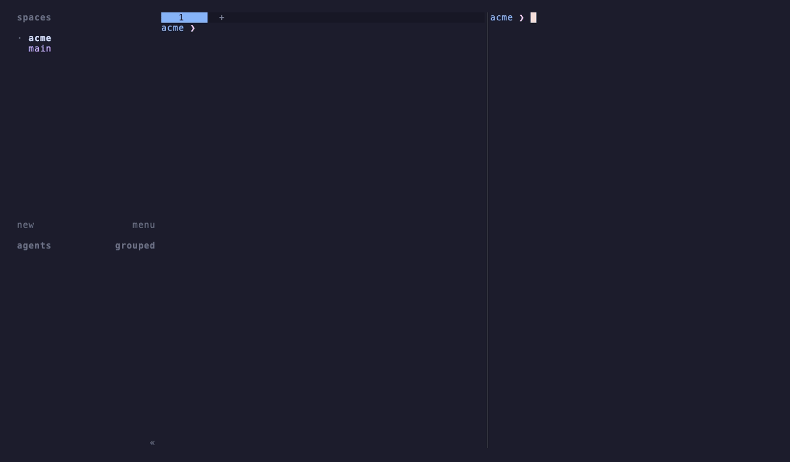
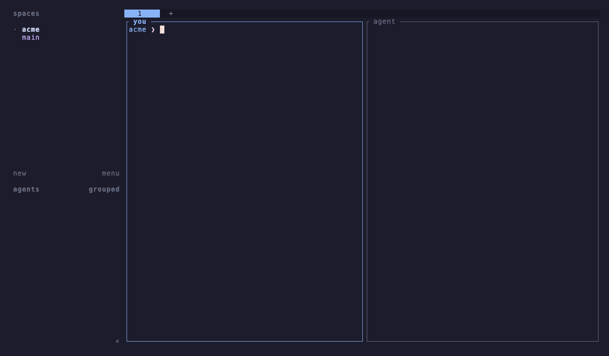
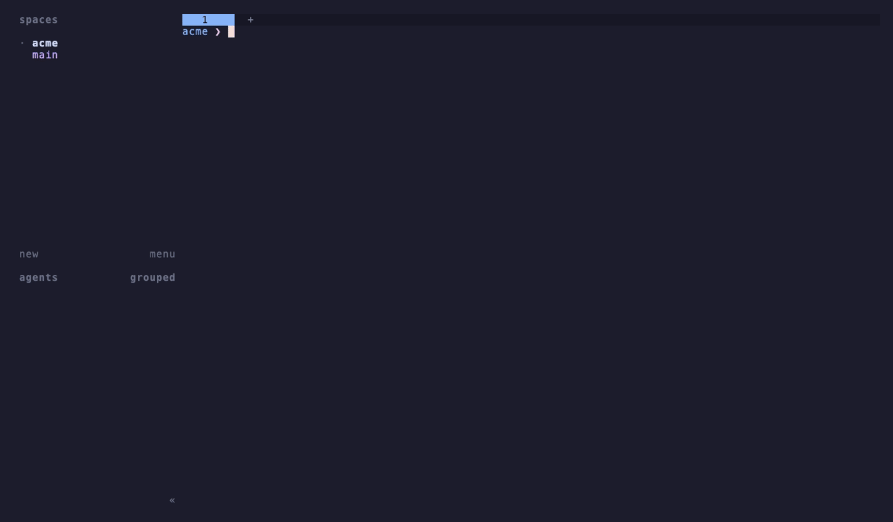

<h1 align="center">herdr-wtm</h1>

<p align="center">
  <strong>Your wtm worktrees, one keypress away in herdr.</strong><br>
  A <a href="https://herdr.dev">herdr</a> plugin for <a href="https://github.com/LucasPcq/wtm">wtm</a>: run worktree commands from a popup, and watch your workspace bar follow your worktrees, whoever changes them.
</p>

<p align="center">
  <a href="https://github.com/LucasPcq/herdr-wtm/releases/latest"></a>
  <a href="https://github.com/LucasPcq/herdr-wtm/actions/workflows/ci.yml"></a>
  <a href="LICENSE"></a>
</p>

> **Status:** 0.x — usable day to day, still evolving with wtm's integration contract. Feedback welcome in the [issues](https://github.com/LucasPcq/herdr-wtm/issues).

## What is wtm?

[**wtm**](https://github.com/LucasPcq/wtm) is a worktree manager built on one idea: **one branch, one worktree, one isolated dev stack**. `git worktree` gives each branch a directory; wtm provisions it (`.env` copied, `on_create` hooks run), gives it its own ports and containers, keeps stacked branches in order with `wtm sync`, and shows everything in `wtm ui`. It is built for scripts and agents too: `--output json`, `--yes`, and a live event stream.

New to wtm? Start with its [README](https://github.com/LucasPcq/wtm#readme) and [getting started guide](https://github.com/LucasPcq/wtm/blob/main/docs/guide/getting-started.md).

## Why herdr + wtm

[herdr](https://herdr.dev) organizes terminals and coding agents into workspaces. wtm decides what a worktree *is*. This plugin connects the two:

- **One menu for wtm.** A key opens a popup with wtm's actions — create, open, checkout a PR, clean, prune, the dashboard. wtm runs in the popup, wizards and pickers included.
- **Your workspace bar follows your worktrees, whoever changes them.** A worktree created from the popup, another shell, an agent or `wtm ui` opens as a herdr workspace; a removed one closes its workspace. Within a second, no refresh.
- **Focus follows you, not your agents.** What you do from the popup takes the focus — clean the worktree you are in and you land on the main checkout. What an agent does in the next pane never steals it.
- **A failed `on_create` hook tells you.** If `pnpm install` fails in a new worktree, a herdr notification names the hook and its exit code.
- **Nothing you care about is closed.** Only linked worktrees whose folder is gone; never the main checkout, never a folder still on disk.

<p align="center">
  
</p>

An agent working in the next pane gets the same treatment: its worktrees open in the sidebar while you keep typing, and a failed `on_create` hook shows up as a notification.

<p align="center">
  
</p>

## Install

You need [herdr](https://herdr.dev) 0.9 or later and [wtm](https://github.com/LucasPcq/wtm) **0.29 or later**:

```bash
brew install LucasPcq/tap/wtm     # or `wtm upgrade` if you have it
cd your-repo && wtm init          # once per repository
herdr plugin install LucasPcq/herdr-wtm
```

Installation downloads the prebuilt binary for your platform (macOS and Linux, amd64 and arm64) and checks it against the release's checksums; without a matching binary it builds from source when Go is installed. Pin a version with `--ref v0.2.0`. Upgrading from 0.1? Read [Migrating to 0.2](docs/guide/migrating-to-0.2.md).

## Usage

Choose the key that opens the menu, once:

```bash
herdr plugin action invoke lucaspcq.wtm.bind
```

Press <kbd>Enter</kbd> for the default, <kbd>prefix</kbd>+<kbd>alt</kbd>+<kbd>w</kbd>, or type your own (`prefix+m`, `ctrl+alt+w`, `f12`…). Keys herdr already uses are refused; the binding is written to herdr's `config.toml` (a backup is kept as `config.toml.bak-herdr-wtm`) and the config is reloaded.

Then press it from any workspace of a wtm repository:

<p align="center">
  
</p>

| # | Entry | What happens |
|---|---|---|
| 1 | New worktree | `wtm create`; the new worktree opens as a focused workspace |
| 2 | Open a worktree | wtm's picker; herdr focuses that workspace, or opens it |
| 3 | Checkout a pull request | `wtm checkout`; the PR's worktree opens, focused |
| 4 | Clean this worktree | `wtm clean` on the current worktree (a picker from the main checkout); you land on the main checkout |
| 5 | Prune finished worktrees | `wtm prune`; the workspaces of removed worktrees close |
| 6 | Dashboard | `wtm ui`; what you create or delete there shows up as you do it |
| 7 | Sync workspaces | closes workspaces left behind, and starts the watcher if it stopped |

<kbd>↑</kbd>/<kbd>↓</kbd> or <kbd>j</kbd>/<kbd>k</kbd> and <kbd>Enter</kbd>, a digit to run an entry, <kbd>Esc</kbd> to close — or click. Every entry is also its own action (`lucaspcq.wtm.create`, `.open`, `.checkout`, `.clean`, `.prune`, `.ui`, `.sync`) to bind to a key or run with `herdr plugin action invoke`.

## Configuration

Optional, in `$(herdr plugin config-dir lucaspcq.wtm)/config.toml`:

```toml
wtm_bin = "wtm"        # path or name on PATH
popup_width = "100"   # size of the command popups (wizards, dashboard)
popup_height = "30"   # unset: each command's own size
```

Details in [Configuration](docs/guide/configuration.md).

## How it works

The plugin never changes what wtm does. When herdr starts, it launches a small watcher that reads wtm's event stream (`wtm events`) and opens or closes workspaces as worktrees come and go, in the repositories herdr shows. The popup only runs wtm commands, tagged so the watcher knows which changes are yours. More in [How it works](docs/guide/how-it-works.md); when something looks off, [Troubleshooting](docs/guide/troubleshooting.md).

## Contributing

```bash
make lint test
make build && herdr plugin link "$PWD"   # `plugin link` does not run [[build]]
```

The architecture, the conventions and the release process are in [`docs/dev/`](docs/dev/architecture.md).

## License

[MIT](LICENSE)
